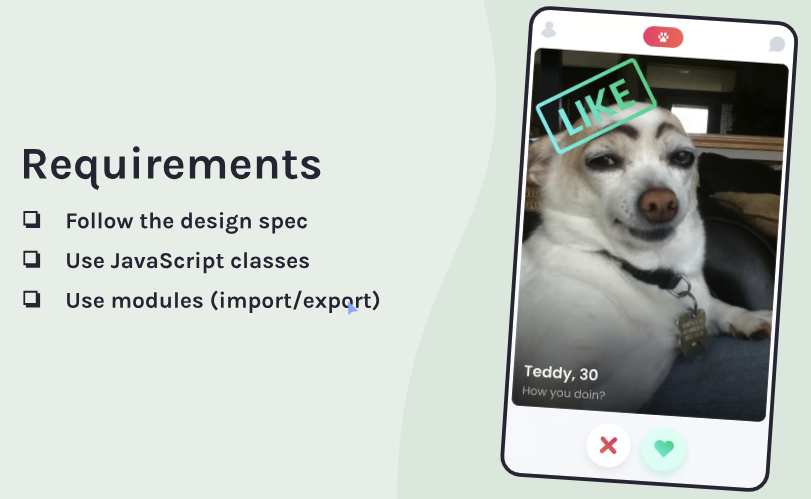
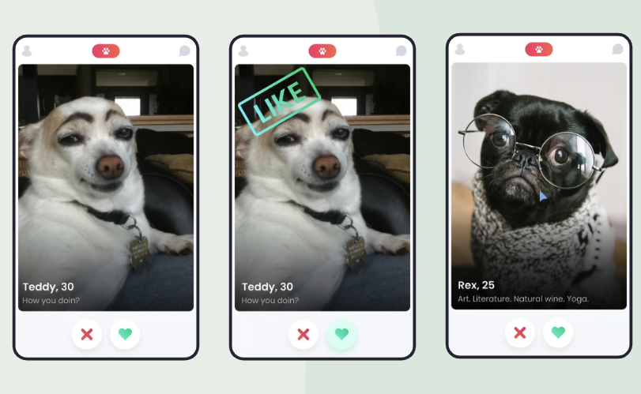

## Tindog Project

### The challenge:

This is a Scrimba solo project using HTML, CSS and JavaScript to create a Tinder app for dogs. Solving this project using JS class (Object Oriented Programming OOP)

### The requirements:



### Visually Depicting Flow:



### How does the app work?

- When clicking on either the x or heart icon a badge appears on top of the image that states either "Like" or "Nope".
- Another dog is displayed after a few seconds
- After having clicked through the images, an end page appears stating how many matches have been made

### Process

- Consult Figma design files
- Create draft of README file
- Create .gitignore file and check that meta tag is included
- Create Github repository
- Work on HTML, CSS and JS files
- Check final code and accessibility
- Finalize README file
- Publish live URL

Also, skills demonstrated in this project:

- Object.assign and this
- Ternary operator
- Object and array destructuring
- New array constructor
- Arrow functions
- setTimeout
- Classes
- import / export

### Useful code snippets and tips

- Came across unset to display the badges when clicking the buttons.

```js
nopeElement.style.display = "unset";
```

- Good example of how to use ternary operator

```js
//end page and show number of matches
function endPageHtml() {
  if (likedDogsCount >= 1) {
    const match = likedDogsCount === 1 ? "match" : "matches";
    dogProfileEl.innerHTML = `
      <div class="end-page">
        <h1>You have ${likedDogsCount} ${match}!</h1>
        
      </div>`;
  } else {
    dogProfileEl.innerHTML = `
      <div class="end-page">
          <h1>Zero matches.</h1>
          
      </div>`;
  }

  nopeBtn.style.visibility = "hidden";
  likeBtn.style.visibility = "hidden";
}
```

- I am happy with this bit of code to render the end page.

```js
import Dog from "./Dog.js";
import dogsData from "./data.js";

let index = 0;
let newDog = new Dog(dogsData[index]);

function getNewDog() {
  index++;

  if (index < dogsData.length) {
    newDog = new Dog(dogsData[index]);
    render();
  } else {
    endPageHtml();
  }
}
```

- Prevent layout shift: Add a min-height attribute on the dog image height="700"

### Code Review Follow up

First of all, thank you to Geoffrey from Scrimba for his code review!

These are the items that needed to be improved.

JavaScript:

- Improve responsiveness for mobile view and make the whole button clickable, not just the icon

- Refactor setTimeout in click handler - no need to repeat it twice:

```js
document.addEventListener("click", function (e) {
  let target = e.target.id;
  const nopeBadge = document.querySelector(".nope-badge");
  const likeBadge = document.querySelector(".like-badge");

  if (target === "no-icon" || target === "nope-btn") {
    nopeBadge.style.display = "unset";

    newDog.hasBeenSwiped = true;
    console.log("swiped:" + newDog.hasBeenSwiped);
  } else if (target === "like-icon" || target === "like-btn") {
    likeBadge.style.display = "unset";
    likedDogsCount++;

    newDog.hasBeenLiked = true;
    console.log("liked" + newDog.hasBeenLiked);
    likedArray.push(newDog);
  }
  setTimeout(() => {
    getNewDog();
  }, 1000);
});
```

- Use the likedArray to display the liked dogs on the endPage. If no liked dogs, then display a sad dog

CSS:

- For improved UX reduce like/cross button size, reduce padding on swipe-icons container

- Use the following CSS to improved responsiveness of image:

```css
.img {
  width: 100%;
  object-fit: cover;
  object-position: right;
}
```

- Reduce the size of the image to enhance UX - i.e. avoid scrolling to get to the like/nope buttons

- Add aria-label to button for accessibility:

```html
<button id="nope-btn" class="nope-btn" aria-label="no-badge"></button>
```

- Perhaps place custom Josh Comeau reset in a separate file, to be reused more easily - or just use CSS normalize

- Place render function at the end of the JS page

### Enhancements still needed

- After clicking the reset button and displaying the dogs a second time, the nope and like buttons appear on the end page. Need to fix this.

- Need to remove the swipe-icons-container from the DOM flow so not to have a lot of empty white space on the end page

- Need to update the project with the names and bio of the liked dogs. Need to add a contact me button as well.

### Resources:

- [Josh Comeau's custom css reset](https://www.joshwcomeau.com/css/custom-css-reset/)

- [Amir from Scrimba showing the difference between using an array of objects instead of an object of objects](https://www.loom.com/share/2e61c3a728cc4474b4523fc5778b6fdf?sid=2fbe7f38-b6db-4530-933e-31a7490a3594)

- [Using unset in JavaScript - any explicit value set for "display" for example will be removed](https://developer.mozilla.org/en-US/docs/Web/CSS/unset)

-[CSS Reset vs. CSS Normalize?](https://elad.medium.com/normalize-css-or-css-reset-9d75175c5d1e)
